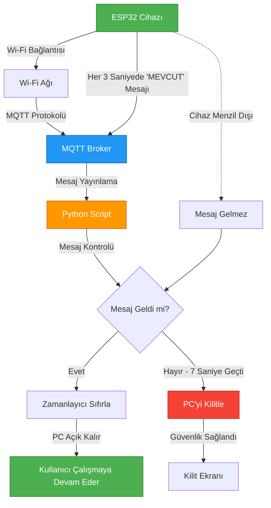
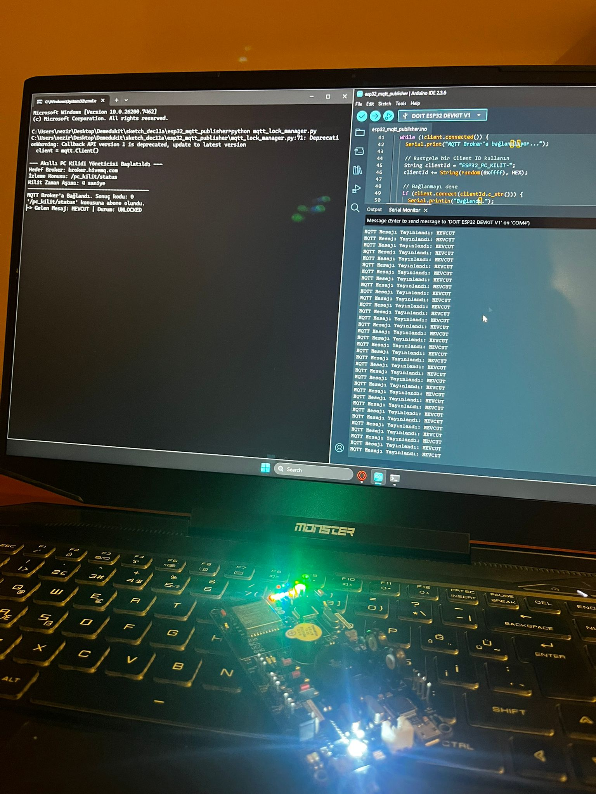
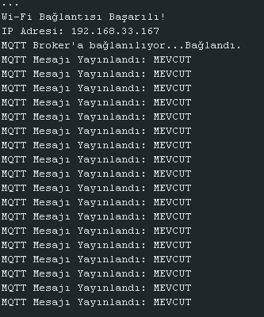
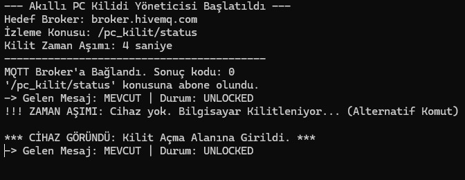
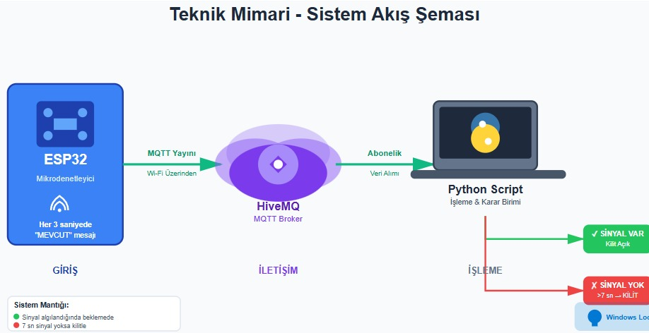

# LockeSense

**İnsan faktörünü devreden çıkaran, düşük maliyetli IoT tabanlı bir güvenlik çözümü.**

---

## 🎯 Problem / Çözüm

### Gözetimsiz Erişim Riski
Geleneksel güvenlik sistemleri, kullanıcıların manuel olarak bilgisayarlarını kilitlemelerine bağlıdır. Ancak insan faktörü her zaman güvenilir değildir:
- Kullanıcılar bilgisayarlarını kilitlemeyi unutabilir
- Acil durumlarda bilgisayar açık bırakılabilir
- Güvenlik farkındalığı yetersiz olabilir

### Sürtünmesiz Güvenlik
LockeSense, bu sorunu **otomatik ve şeffaf** bir şekilde çözer:
- ✅ Kullanıcı cihazı yanında taşır
- ✅ Sistem otomatik olarak varlığı algılar
- ✅ Cihaz menzil dışına çıktığında PC otomatik kilitlenir
- ✅ Kullanıcı geri döndüğünde sistem hazır olur
- ✅ **Hiçbir manuel müdahale gerekmez**

---

## 🏗️ Teknik Mimari

### Sistem Akış Şeması



### Bileşenler

#### 1. **ESP32 Mikrodenetleyici**
- Wi-Fi bağlantısı kurar
- MQTT broker'a bağlanır
- Her 3 saniyede bir "MEVCUT" sinyali gönderir
- Düşük güç tüketimi ile uzun süreli çalışma

#### 2. **MQTT Broker**
- ESP32 ve PC arasında iletişim köprüsü
- Pub/Sub (Yayınlama/Abonelik) mimarisi
- Gerçek zamanlı mesajlaşma

#### 3. **Python Yönetim Scripti**
- MQTT mesajlarını dinler
- Zamanlayıcı ile güvenlik kontrolü yapar
- Windows API ile PC kilitleme işlemi gerçekleştirir
- Otomatik yeniden bağlanma mekanizması

---

## 🚀 Özellikler

- 🔒 **Otomatik Kilitleme**: Cihaz menzil dışına çıktığında otomatik kilit
- ⚡ **Gerçek Zamanlı İzleme**: 3 saniyede bir varlık kontrolü
- 🔄 **Otomatik Yeniden Bağlanma**: Bağlantı kopmalarında otomatik düzeltme
- 💰 **Düşük Maliyet**: ESP32 ve açık kaynak yazılım
- 🛡️ **Güvenli**: Windows API ile sistem seviyesi kilitleme
- 📱 **Taşınabilir**: Küçük ve hafif cihaz tasarımı

---

## 📋 Gereksinimler

### Donanım
- ESP32 DevKit V1 (veya uyumlu model)
- Wi-Fi erişimi olan ağ
- Windows işletim sistemi (PC kilitleme için)

### Yazılım
- Arduino IDE (ESP32 programlama için)
- Python 3.x
- Gerekli Python kütüphaneleri (bkz. `Yazilim/Bagimliliklar/requirements.txt`)

---

## 🔧 Kurulum

### 1. ESP32 Kurulumu

1. Arduino IDE'yi açın
2. ESP32 board desteğini ekleyin (Board Manager)
3. Gerekli kütüphaneleri yükleyin:
   - `WiFi` (ESP32 ile birlikte gelir)
   - `PubSubClient` (Library Manager'dan yükleyin)
4. `Donanim/ESP32_Kod/esp32_mqtt_publisher.ino` dosyasını açın
5. **Hassas bilgileri yapılandırın:**
   - `Donanim/ESP32_Kod/secrets.h.example` dosyasını kopyalayın
   - `Donanim/ESP32_Kod/secrets.h` olarak kaydedin
   - Wi-Fi ve MQTT bilgilerinizi girin:
     ```cpp
     const char* ssid = "WIFI_ADINIZ";
     const char* password = "WIFI_SIFRENIZ";
     const char* mqtt_server = "broker.hivemq.com";
     ```
6. Kodu ESP32'ye yükleyin

### 2. Python Script Kurulumu

1. Python 3.x'in yüklü olduğundan emin olun
2. Bağımlılıkları yükleyin:
   ```bash
   pip install -r Yazilim/Bagimliliklar/requirements.txt
   ```
3. **Hassas bilgileri yapılandırın:**
   - `Yazilim/Python_Script/env.example` dosyasını kopyalayın
   - `Yazilim/Python_Script/.env` olarak kaydedin
   - MQTT ayarlarınızı kontrol edin (varsayılan değerler genellikle yeterlidir)
4. Scripti çalıştırın:
   ```bash
   python Yazilim/Python_Script/mqtt_lock_manager.py
   ```

### 3. Yapılandırma

**ÖNEMLİ:** Her iki dosyada da MQTT broker ve topic ayarlarının aynı olduğundan emin olun:
- **MQTT Broker**: `broker.hivemq.com` (veya kendi broker'ınız)
- **MQTT Topic**: `/pc_kilit/status`
- **Kilit Zaman Aşımı**: 7 saniye (`.env` dosyasında ayarlanabilir)

### 4. Güvenlik Notları

⚠️ **Hassas bilgiler GitHub'a yüklenmez:**
- `secrets.h` ve `.env` dosyaları `.gitignore` ile korunmaktadır
- Bu dosyaları manuel olarak oluşturmanız gerekmektedir
- Örnek dosyalar (`secrets.h.example` ve `env.example`) referans için mevcuttur

---

## 📸 Demo

### Sistem Çalışma Hali


*ESP32 DevKit V1 cihazı laptop üzerinde çalışır durumda. Arduino IDE ve Python script'i aynı anda çalışıyor. Yeşil LED'ler sistemin aktif olduğunu gösteriyor.*

### Python Script Çıktısı


*Python script'inin konsol çıktısı. MQTT broker'a başarıyla bağlanıldı (`broker.hivemq.com`), `/pc_kilit/status` topic'ine abone olundu ve "MEVCUT" mesajları alınıyor. Sistem "UNLOCKED" durumunda.*

### Arduino Serial Monitor


*ESP32'nin Serial Monitor çıktısı. Wi-Fi bağlantısı başarılı (IP: 192.168.1.XXX), MQTT broker'a bağlanıldı ve her 3 saniyede bir "MEVCUT" mesajı gönderiliyor.*

### Sistem Akış Şeması


*Sistemin teknik mimarisi: ESP32 → MQTT Broker → Python Script → Windows Lock/Unlock karar mekanizması.*

> **Not**: Tüm görseller `Dokumantasyon/Gorseller/` klasöründe bulunmaktadır. Görsel ekleme talimatları için [Görseller README](Dokumantasyon/Gorseller/README.md) dosyasına bakınız.

---

## 📁 Proje Yapısı

```
LockeSense/
├── Donanim/
│   ├── ESP32_Kod/          # Arduino .ino dosyaları
│   └── README_DONANIM.md   # Donanım dokümantasyonu
├── Yazilim/
│   ├── Python_Script/      # Ana Python scripti
│   ├── Bagimliliklar/      # requirements.txt
│   └── README_YAZILIM.md   # Yazılım dokümantasyonu
├── Dokumantasyon/
│   ├── Sunumlar/           # Ideathon sunum dosyaları (PPT/PDF)
│   └── Gorseller/          # MVP fotoğrafları ve görseller
├── LICENSE                 # MIT Lisansı
└── README.md               # Bu dosya
```

---

## 🛠️ Geliştirme

### Katkıda Bulunma

1. Bu repository'yi fork edin
2. Yeni bir branch oluşturun (`git checkout -b feature/yeni-ozellik`)
3. Değişikliklerinizi commit edin (`git commit -am 'Yeni özellik eklendi'`)
4. Branch'inizi push edin (`git push origin feature/yeni-ozellik`)
5. Pull Request oluşturun

### Sorun Bildirimi

Herhangi bir sorun veya öneri için [Issues](../../issues) bölümünü kullanabilirsiniz.

---

## 📄 Lisans

Bu proje MIT Lisansı altında lisanslanmıştır. Detaylar için [LICENSE](LICENSE) dosyasına bakınız.

---

## 👥 Ekip

Bu proje bir Ideathon projesi olarak geliştirilmiştir.

## 📊 Sunum

Proje sunumu için [Sunumlar klasörüne](Dokumantasyon/Sunumlar/) bakabilirsiniz.
- **Ana Sunum**: [01_ideathon_sunum.pptx](Dokumantasyon/Sunumlar/01_ideathon_sunum.pptx)
- **Sunum Hazırlama Rehberi**: [SUNUM_HAZIRLAMA_REHBERI.md](Dokumantasyon/Sunumlar/SUNUM_HAZIRLAMA_REHBERI.md)

---

## 🙏 Teşekkürler

- ESP32 topluluğu
- MQTT protokolü geliştiricileri
- Açık kaynak topluluğu

---

**⭐ Bu projeyi beğendiyseniz yıldız vermeyi unutmayın!**
