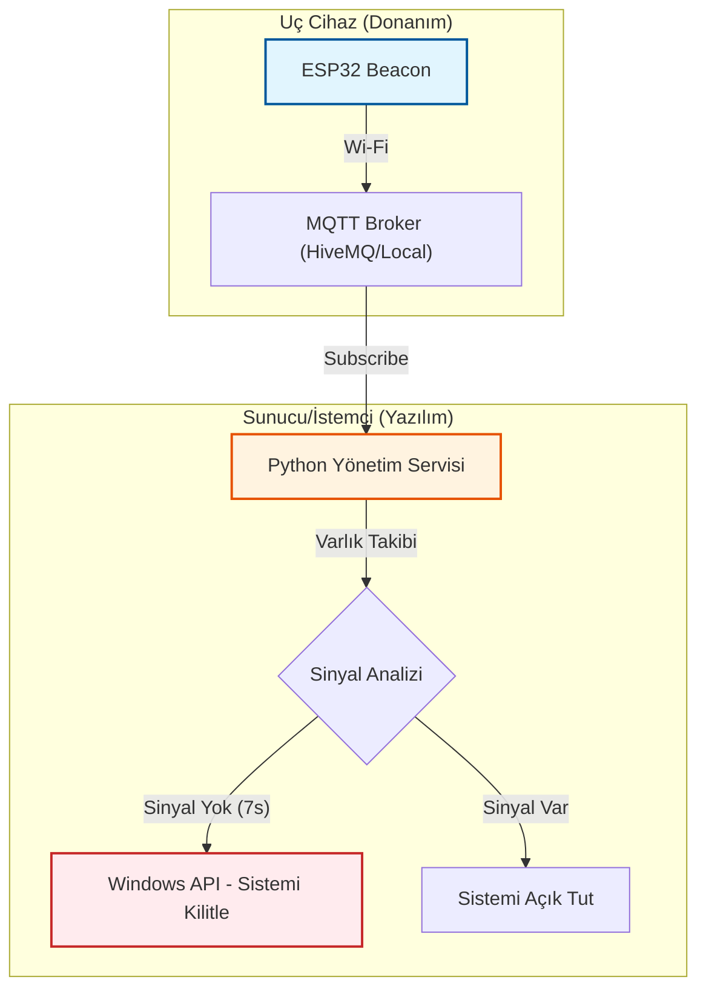

# LockeSense: IoT Tabanlı Akıllı Güvenlik ve Erişim Sistemi

[](https://opensource.org/licenses/MIT)
[](https://www.microsoft.com/windows)
[](https://www.espressif.com/en/products/socs/esp32)

**LockeSense**, insan faktöründen kaynaklanan güvenlik açıklarını minimize etmek amacıyla geliştirilmiş, düşük maliyetli ve yüksek verimli bir IoT tabanlı otomatik kilitleme çözümüdür. Kullanıcının fiziksel varlığını bir ESP32 cihazı üzerinden takip ederek, bilgisayarın güvenliğini otonom bir şekilde yönetir.

---

## 📖 Proje Hakkında

Geleneksel güvenlik protokolleri, kullanıcıların sistem başından ayrılırken manuel müdahalesini (örn. `Win + L`) gerektirir. LockeSense, bu süreci tamamen otomatize ederek "sürtünmesiz güvenlik" (frictionless security) sunar.

### Temel Problemler ve Çözümler
*   **Problem:** Kullanıcıların bilgisayarlarını kilitlemeyi unutması veya acil durumlarda açık bırakması.
*   **Çözüm:** Kullanıcının yanında taşıdığı ESP32 tabanlı bir "beacon" cihazı ile varlık tespiti ve otonom kilitleme.
*   **Problem:** Karmaşık ve pahalı kurumsal güvenlik sistemleri.
*   **Çözüm:** Açık kaynaklı yazılım ve uygun maliyetli donanım bileşenleri ile erişilebilir güvenlik.

---

## 🏗️ Teknik Mimari

LockeSense, düşük gecikme süreli ve güvenilir bir iletişim için **MQTT (Message Queuing Telemetry Transport)** protokolünü kullanır.

### Sistem Akış Şeması


```mermaid
graph TD
    subgraph "Uç Cihaz (Donanım)"
        A["ESP32 Beacon"] -->|Wi-Fi| B["MQTT Broker (HiveMQ/Local)"]
    end

    subgraph "Sunucu/İstemci (Yazılım)"
        B -->|Subscribe| C["Python Yönetim Servisi"]
        C -->|Varlık Takibi| D{"Sinyal Analizi"}
        D -- "Sinyal Yok (7s)" --> E["Windows API - Sistemi Kilitle"]
        D -- "Sinyal Var" --> F["Sistemi Açık Tut"]
    end

    style A fill:#e1f5fe,stroke:#01579b,stroke-width:2px
    style C fill:#fff3e0,stroke:#e65100,stroke-width:2px
    style E fill:#ffebee,stroke:#c62828,stroke-width:2px
```

### Bileşen Detayları
1.  **Donanım Katmanı**: ESP32 mikrodenetleyicisi, optimize edilmiş güç tüketimi ile 3 saniyelik aralıklarla "MEVCUT" sinyali yayınlar.
2.  **İletişim Katmanı**: MQTT Broker, cihaz ve PC arasında köprü görevi görerek mesaj trafiğini yönetir.
3.  **Mantıksal Katman**: Python tabanlı arka plan servisi, gelen sinyalleri işler ve tanımlanan zaman aşımı (timeout) parametrelerine göre Windows kilit mekanizmasını tetikler.

---

## 🛡️ Güvenlik ve Gizlilik

LockeSense, güvenlik odaklı bir tasarım prensibi benimser:
*   **Yerel Kontrol**: Sistem, Windows'un native kilit API'lerini kullanarak en üst düzeyde sistem entegrasyonu sağlar.
*   **Veri Gizliliği**: `.env` ve `secrets.h` yapılandırmaları ile Wi-Fi ve MQTT kimlik bilgileri repo dışında tutulur.
*   **Manipülasyon Koruması**: Beklenmedik bağlantı kopmalarında sistem güvenli tarafta kalmak adına (fail-secure) kilitleme eğilimindedir.

---

## 🚀 Hızlı Başlangıç

### 🔧 Donanım Kurulumu
1.  `Donanim/ESP32_Kod/secrets.h.example` dosyasını `secrets.h` olarak kopyalayın.
2.  Wi-Fi ve MQTT bilgilerinizi girin.
3.  Arduino IDE üzerinden kodu ESP32 cihazınıza yükleyin.
4.  Detaylı rehber: [Donanım Dokümantasyonu](Donanim/README_DONANIM.md)

### 💻 Yazılım Kurulumu
1.  Python 3.x gereksinimlerini yükleyin:
    ```bash
    pip install -r Yazilim/Bagimliliklar/requirements.txt
    ```
2.  Python servisini başlatın:
    ```bash
    python Yazilim/Python_Script/mqtt_lock_manager.py
    ```
3.  Detaylı rehber: [Yazılım Dokümantasyonu](Yazilim/README_YAZILIM.md)

---

## 📋 Yol Haritası (Roadmap)

- [ ] **Güç Optimizasyonu**: ESP32 için Deep Sleep modunun entegrasyonu.
- [ ] **Bağlantı Çeşitliliği**: Bluetooth Low Energy (BLE) desteğinin eklenmesi.
- [ ] **Mobil Uygulama**: Cihaz durumunu izlemek için bir kontrol paneli.
- [ ] **Çoklu OS Desteği**: macOS ve Linux sistemleri için kilitleme scriptleri.

---

## 🔍 Sorun Giderme

| Sorun | Olası Neden | Çözüm |
| :--- | :--- | :--- |
| ESP32 bağlanamıyor | Yanlış Wi-Fi Bilgisi | `secrets.h` dosyasını kontrol edin. |
| Zaman aşımı hatası | MQTT Topic uyumsuzluğu | Hem kodda hem scriptte Topic adını doğrulayın. |
| PC kilitlenmiyor | Python yetki sorunu | Terminali yönetici olarak çalıştırmayı deneyin. |

---

## 🤝 Katkıda Bulunma

Projeye katkıda bulunmak isterseniz lütfen önce bir [Issue](../../issues) açarak yapmak istediğiniz değişikliği tartışın. Pull Request'leriniz titizlikle incelenecektir.

---

## 📄 Lisans

Bu proje **MIT Lisansı** altında lisanslanmıştır. Detaylar için [LICENSE](LICENSE) dosyasına göz atın.

---

## 👥 Geliştirme Ekibi

*   **Nezir Erdoğan**
*   **Vahit Hamza Baran**
*   **Miray Tiryaki**
*   **Nuran Ergenç**

---

## 🙏 Teşekkürler

Bu çalışma, bir Ideathon projesi kapsamında geliştirilmiştir. Geliştirme sürecinde katkısı bulunan tüm açık kaynak topluluklarına teşekkür ederiz.

**⭐ Proje vizyonumuzu desteklemek için yıldız vermeyi unutmayın!**
